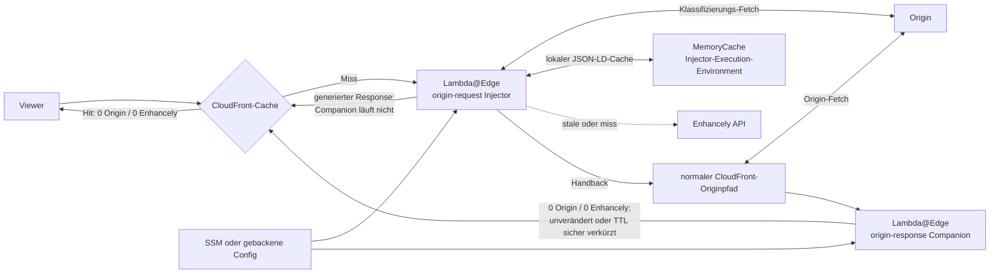
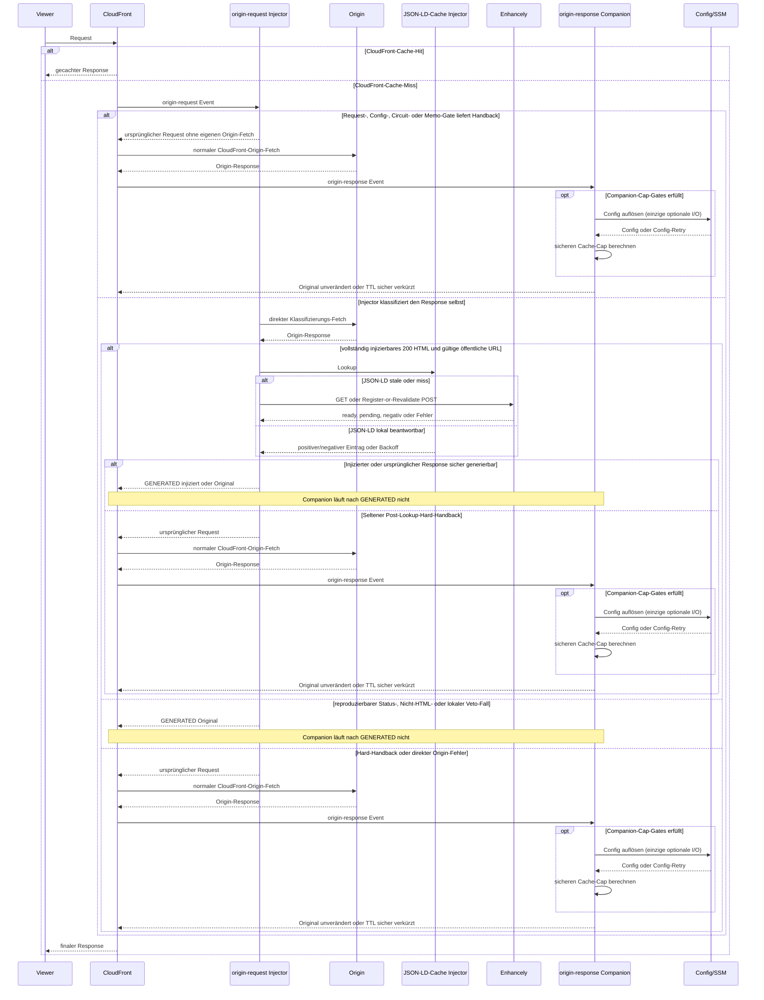
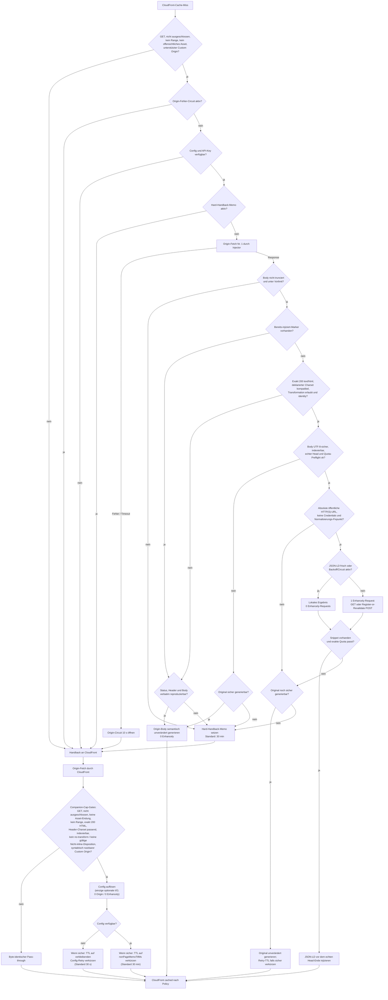

# Aktuelle Connector-Laufzeitarchitektur

Diese Datei ist die kundenunabhängige Referenz für die aktuelle Implementierung des
Enhancely Connectors. Sie beschreibt, welche Komponente wann Origin und Enhancely
aufruft, wie nicht injizierbare Antworten behandelt werden und welche voneinander
unabhängigen Cache-, Retry- und Circuit-Zeiten gelten.

Für das tatsächliche Laufzeitverhalten ist diese Datei maßgeblich.

## Kurzfassung

Der empfohlene CloudFront-Aufbau besteht aus zwei Lambda@Edge-Funktionen auf demselben
Cache Behavior:

1. Der **`origin-request`-Injector** holt den Origin zuerst selbst ab. Erst wenn die
   Antwort ein tatsächlich injizierbares `200 text/html` ist, wird der lokale
   JSON-LD-Cache beziehungsweise Enhancely betrachtet.
2. Der **`origin-response`-Companion** ist ein nicht injizierendes Sicherheitsnetz.
   Er läuft nur für Requests, die der Injector an den normalen CloudFront-Originpfad
   zurückgegeben hat. Er ruft weder Enhancely noch den Origin auf und besitzt keinen
   JSON-LD-Cache. Er kann ausschließlich die Cache-Laufzeit einer geeigneten,
   nicht injizierten Antwort sicher verkürzen.

Die zentralen Eigenschaften sind:

- Ein CloudFront-Cache-Hit verursacht **0 Origin- und 0 Enhancely-Requests**.
- Der normale injizierbare Cache-Miss verursacht **1 Origin-Request** und abhängig
  vom JSON-LD-Cache **0 oder höchstens 1 Enhancely-Request**.
- Das empfohlene Funktionspaar verursacht pro Viewer-Request insgesamt **nie mehr als
  1 Enhancely-Request**; dieser kann ausschließlich im `origin-request`-Injector
  entstehen.
- Reproduzierbare Redirects, Fehlerseiten und kleine Nicht-HTML-Antworten verursachen
  **1 Origin-Request und 0 Enhancely-Requests**.
- Der Companion injiziert nie, ruft den Origin nie selbst auf und ruft Enhancely nie
  auf. Seine einzige optionale I/O ist die serverseitige Config-Auflösung.
- Ein vom `origin-request`-Injector erzeugter Response löst den Companion nicht aus.
- Connector- und Enhancely-Fehler nach einer verfügbaren Origin-Antwort sind fail-open:
  Ein noch nutzbarer positiver JSON-LD-Eintrag darf bei einem Enhancely-Ausfall weiter
  injiziert werden; andernfalls bleibt die Origin-Antwort erhalten. Kann der Origin
  selbst nicht erreicht werden, greift das Fehlerverhalten der jeweiligen Plattform.

## Begriffe und Zählweise

Die Request-Zahlen in diesem Dokument gelten pro **Viewer-Request** und, sofern nicht
anders angegeben, pro **CloudFront-Cache-Miss**.

- **Origin-Request**: Ein logischer Fetch im Connector-Ablauf. Dabei wird zwischen dem
  direkten Klassifizierungs-Fetch des Injectors und einem eventuell folgenden normalen
  CloudFront-Origin-Fetch unterschieden.
- **Enhancely-Request**: Ein externer HTTP-Aufruf zur Enhancely API. Ein lokaler
  Cache-Zugriff zählt nicht als Request.
- **Generierter Response**: Der Injector gibt den bereits geholten Origin-Response
  selbst an CloudFront zurück. CloudFront fragt den Origin dann nicht noch einmal und
  der Companion läuft nicht.
- **Handback**: Der Injector gibt den ursprünglichen CloudFront-Request zurück.
  CloudFront führt anschließend seinen normalen Origin-Fetch aus; danach kann der
  Companion laufen.
- **Reproduzierbar**: Status und Body passen in die Lambda@Edge-Limits und dürfen
  semantisch unverändert als generierter Response zurückgegeben werden. Der Body bleibt
  dabei byteidentisch; CloudFront-verbotene, hop-by-hop und von `Connection` benannte
  Header müssen entfernt und Headernamen werden kanonisiert.

Die Tabellen unterscheiden außerdem zwischen einem **logischen Lookup** und einem
externen Enhancely-Request. Ein logischer Lookup kann vollständig aus dem JSON-LD-Cache
beantwortet werden und verursacht dann keinen Netzwerkaufruf.

Die Origin-Zahlen sind damit Architektur- und keine TCP-Zähler. CloudFront kann einen
normalen Origin-Fetch gemäß seiner Origin-Konfiguration intern wiederholen, bei einer
Origin Group auf ein Secondary Origin wechseln oder für eine Custom Error Response
einen weiteren Seiten-Fetch ausführen. Solche Plattform-Retries, Failover- und
Fehlerseiten-Fetches kommen zu den Tabellenwerten hinzu; das gilt auch für die spätere
Compatibility-Tabelle.

## Deployment-Modi und Origin-Grenze

| Modus                                   | Aufbau                                 | Tatsächliche Origin-Semantik                                                                                                                                       |
| --------------------------------------- | -------------------------------------- | ------------------------------------------------------------------------------------------------------------------------------------------------------------------ |
| `origin-request` (Default)              | Origin-Request-Injector plus Companion | Der Injector klassifiziert per Direkt-Fetch. Generierbarer Pfad: dieser eine Fetch; Handback: danach normaler CloudFront-Fetch. Nur erreichbare Custom Origins.    |
| `origin-response` (Compatibility-Modus) | Standalone Origin-Response-Injector    | Fetch 1 läuft über CloudFront; nur bei vorhandenem Snippet folgt Fetch 2 direkt aus der Lambda. Auch dieser Modus benötigt daher einen erreichbaren Custom Origin. |

Beide Injektionsmodi können aktuell nur `request.origin.custom` selbst abrufen.
S3-REST-Origins einschließlich S3-OAC (`request.origin.s3`) werden an den normalen
CloudFront-Pfad durchgereicht und nicht injiziert. Private VPC Origins und andere nicht
direkt aus Lambda erreichbare Custom Origins können ebenfalls nicht injiziert werden;
der Default-Pfad versucht zunächst seinen Direkt-Fetch und fällt bei dessen Fehler auf
CloudFront zurück. Ein signaturgeschützter Custom Origin ist ausdrücklich nicht
unterstützt: Der Direkt-Fetch ist unsigniert und ein Origin-`403` kann im Default-Pfad
als generierter Response zurückgegeben werden. Diesen Modus dort nicht assoziieren.

Origin Groups/Failover, Origin Shield und CloudFronts eigene
Origin-Connection-/Retry-Semantik gelten nicht für einen direkten Lambda-Fetch: Im
Compatibility-Modus wirken sie zwar auf den ersten CloudFront-Fetch, nicht jedoch auf
den zweiten Body-Re-Fetch. Wer diese Semantik für jeden Fetch benötigt, braucht eine
andere Integrationsarchitektur; der jetzige Connector verspricht sie nicht.

## Komponenten

| Komponente                    | Verantwortung                                                                                                                                                                                 |
| ----------------------------- | --------------------------------------------------------------------------------------------------------------------------------------------------------------------------------------------- |
| CloudFront-Cache              | Speichert die fertige HTML- oder Pass-through-Antwort nach der Origin-/Behavior-Cache-Policy.                                                                                                 |
| `origin-request`-Injector     | Request-Gates, höchstens ein eigener Origin-Fetch, Response-Gates, HTML-Preflight, JSON-LD-Lookup und Injektion.                                                                              |
| `origin-response`-Companion   | Läuft nur nach Handback und begrenzt bei Bedarf sicher die Cache-Laufzeit einer geeigneten nicht injizierten Antwort. Keine Injektion, kein Origin- oder Enhancely-Fetch, kein JSON-LD-Cache. |
| `injector-core`               | URL-Normalisierung, Enhancely Client, JSON-LD-Cache, ETag-Revalidierung, Single-flight, Rate-Limit-Circuit und HTML-Injektion.                                                                |
| SSM / gebackene Konfiguration | Liefert API-Key und Laufzeitkonfiguration serverseitig. Der API-Key erreicht nie den Browser.                                                                                                 |
| Enhancely API                 | Liefert fertiges JSON-LD oder registriert/revalidiert eine URL.                                                                                                                               |

## Komponentendiagramm



Wichtig: Injector und Companion sind getrennte Lambda-Flotten. Nur der Injector besitzt
einen JSON-LD-MemoryCache, Lookup-Single-flights und ein Enhancely-Ausfall-Memo. Der
Companion besitzt keinen dieser Zustände; lediglich die Config-Auflösung hat ihren
eigenen Config-Cache, In-flight-Single-flight und negativen Retry-Termin.

## Sequenz der drei Hauptpfade



## Ablauf des empfohlenen CloudFront-Pfads



## Reihenfolge der lokalen Prüfungen

Der Injector fragt Enhancely erst, wenn alle lokal verfügbaren Beweise positiv sind.
Die Reihenfolge ist absichtlich günstig nach Kosten sortiert:

1. Nur `GET`.
2. Kein konfigurierter `excludePaths`-Treffer.
3. Keine bekannte Nicht-HTML-Dateiendung wie `.css`, `.js`, `.json`, Bilder,
   Schriften, Medien, Archive oder Office-Dateien.
4. Kein `Range`-Request.
5. Unterstützter Custom Origin und nicht leerer virtueller Host.
6. Kein aktiver Origin-Fehler-Circuit.
7. API-Key/Config ist verfügbar.
8. Kein aktives Hard-Handback-Memo.
9. Origin zuerst holen. Netzwerk-, Timeout-, Protokoll- oder unvollständige
   Body-Fehler öffnen den 10-Sekunden-Origin-Circuit und führen zum Handback.
10. Ein wegen der Größe truncierter Body führt zum 30-Minuten-Hard-Handback-Memo.
11. Kein vorhandener `X-Enhancely-Injected`-Marker.
12. Exakt `200`; `Content-Type` kommt in genau einer Feldinstanz mit genau einem
    eindeutigen Medientyp `text/html` vor; ein deklarierter Charset ist
    UTF-8-kompatibel. Top-Level-Kommas, Unicode-Pseudo-OWS und unausgeglichene
    HTTP-Quotes sind ein Veto.
13. Kein `Cache-Control: no-transform` und keine gültige
    Nicht-`inline`-`Content-Disposition` (einschließlich `attachment` und
    unbekannter gültiger Typen). Ein explizites `no-transform` bleibt auch bei
    fehlerhaften Whitespace-/Semikolon-Trennern wirksam; unausgeglichene Quotes
    vetoen konservativ.
14. Kein `Content-Encoding` auf dem angeforderten Identity-Response.
15. Kein `X-Robots-Tag: noindex` oder `none`; die Sperre bleibt auch bei
    fehlerhaften Whitespace-/Semikolon-Trennern wirksam.
16. Der tatsächliche Body ist UTF-8-sicher beziehungsweise eindeutig sicher dekodierbar.
17. Ein realer, parser-sicherer `</head>`-Einfügepunkt existiert.
18. Header und HTML plus minimaler Script-Wrapper passen grundsätzlich in die
    CloudFront-Limits.
19. Die öffentliche URL ist absolut HTTP(S), enthält keine Credentials und ist nach
    `normalizeLite` ein Fixpunkt. Ein Fehler endet lokal vor Cache und API.
20. Erst jetzt: JSON-LD-Cache prüfen und bei Bedarf Enhancely aufrufen.
21. Mit der tatsächlichen Snippet-Größe die exakte Response-Quota prüfen.

`Set-Cookie`, `private` und `no-store` verhindern im empfohlenen Origin-Request-Pfad
keine Injektion. Es gibt dort nur eine Origin-Antwort; sie wird inklusive dieser Header
an den Viewer weitergegeben. Diese Antworten werden durch den Connector nicht
zusätzlich cachebar gemacht. Ein `no-store`-Response kann deshalb bei jedem
Viewer-Request einen neuen Origin-Fetch verursachen; der lokale JSON-LD-Cache kann den
Enhancely-Anteil innerhalb seiner Freshness-TTL trotzdem auf null reduzieren.

## Request-Matrix

Die Werte in der Spalte **Origin gesamt** enthalten sowohl den direkten Injector-Fetch
als auch einen eventuell folgenden CloudFront-Fetch. `0/1` bei Enhancely bedeutet:
lokaler Cache/Backoff `0`, echter stale/miss Lookup `1`.

| Fall pro Viewer-Request                                                                                                                                                                                   |                                 Origin gesamt | Enhancely extern | Companion                       | Ergebnis                                                                                                                                                  |
| --------------------------------------------------------------------------------------------------------------------------------------------------------------------------------------------------------- | --------------------------------------------: | ---------------: | ------------------------------- | --------------------------------------------------------------------------------------------------------------------------------------------------------- |
| CloudFront-Cache-Hit                                                                                                                                                                                      |                                             0 |                0 | nein                            | Bereits gecachter Response.                                                                                                                               |
| Non-GET, ausgeschlossener Pfad, Range, nicht unterstützter Origin oder fehlender Host                                                                                                                     |                                             1 |                0 | ja, aber Gate-Exit              | Normaler CloudFront-Originpfad, unverändert.                                                                                                              |
| Offensichtliche Asset-Endung; Origin liefert Nicht-HTML, Status ungleich `200` oder sogar unerwartet `200 text/html`                                                                                      |                                             1 |                0 | ja, aber Extension-Gate         | Beide Funktionen schließen Asset-Endungen aus. Keine Injektion, kein künstlicher Companion-Cap.                                                           |
| Fehlende Config/API-Key                                                                                                                                                                                   |                                             1 |                0 | ja                              | Der Injector gibt vor dem Direkt-Fetch zurück. Der Companion darf nur die Config auflösen und bei sonst geeigneter Antwort sicher auf deren Retry kappen. |
| Reproduzierbarer Redirect oder kleine `4xx`-/`5xx`-Antwort                                                                                                                                                |                                             1 |                0 | nein                            | Status, Header und Body werden aus dem ersten Fetch zurückgegeben.                                                                                        |
| Reproduzierbarer leerer `204`                                                                                                                                                                             |                                             1 |                0 | nein                            | Leerer `204` wird aus dem ersten Fetch zurückgegeben.                                                                                                     |
| Nicht reproduzierbarer `201`–`203`, `204` mit Body/zu großen Headern, `205`–`299`, `304` oder übergroßer Fehlerresponse, erstes Auftreten                                                                 |                                             2 |                0 | ja; Status-Gate                 | Injector klassifiziert einmal, danach übernimmt CloudFront.                                                                                               |
| Derselbe nicht reproduzierbare Status während des Hard-Handback-Memos                                                                                                                                     |                                             1 |                0 | ja; Status-Gate                 | Injector überspringt seinen Klassifizierungs-Fetch.                                                                                                       |
| Kleines reproduzierbares `200`, aber nicht `text/html`                                                                                                                                                    |                                             1 |                0 | nein                            | Binär/verbatim aus dem ersten Fetch.                                                                                                                      |
| Nicht reproduzierbares oder zu großes `200` Nicht-HTML, erstes Auftreten                                                                                                                                  |                                             2 |                0 | ja; Content-Type-Gate           | Handback; Hard-Handback-Memo wird gesetzt.                                                                                                                |
| Dasselbe Nicht-HTML während des Hard-Handback-Memos                                                                                                                                                       |                                             1 |                0 | ja; Content-Type-Gate           | Nur normaler CloudFront-Origin-Fetch.                                                                                                                     |
| Reproduzierbares `200 text/html`, aber lokaler Veto vor Enhancely, z. B. `noindex`, unsichere Zeichenkodierung, `no-transform`, gültige Nicht-inline-Disposition, kein echter Head oder Mindestquota-Veto |                                             1 |                0 | nein                            | Original wird unverändert aus dem ersten Fetch generiert.                                                                                                 |
| Übergroßes/truncated `200 text/html`, Veto vor Enhancely                                                                                                                                                  | 2 beim ersten Mal, danach 1 während des Memos |                0 | ja; optional sicherer Cache-Cap | Companion sieht Body/Head/Quota nicht, ruft deshalb Enhancely nie auf und kappt höchstens auf `nonPageMemoTtlMs`.                                         |
| Injizierbares `200 text/html`, positiver JSON-LD-Cache frisch                                                                                                                                             |                                             1 |                0 | nein                            | Snippet aus MemoryCache injiziert.                                                                                                                        |
| Injizierbares `200 text/html`, negativer Cache oder Backoff ohne positiven stale Eintrag                                                                                                                  |                                             1 |                0 | nein                            | Original unverändert; keine erneute API-Last.                                                                                                             |
| Injizierbares `200 text/html`, positiver stale Eintrag während API-Fehler-, Timeout- oder Rate-Limit-Backoff                                                                                              |                                             1 |                0 | nein                            | Stale JSON-LD wird weiter injiziert; nach dem Backoff wird erneut revalidiert.                                                                            |
| Injizierbares `200 text/html`, aber öffentliche URL ist ungültig, enthält Credentials oder ist nicht normalisierungsstabil                                                                                |                                             1 |                0 | nein                            | Core lehnt vor Cache/API lokal ab; Original wird generiert.                                                                                               |
| Injizierbares `200 text/html`, JSON-LD stale oder miss                                                                                                                                                    |                                             1 |      höchstens 1 | nein                            | `200/304/412` kann injizieren; eine definitive negative Antwort liefert Original, ein transienter Fehler darf stale JSON-LD nutzen.                       |
| Tatsächliches Snippet überschreitet erst nach dem Lookup die Quota, Original passt noch                                                                                                                   |                                             1 |              0/1 | nein                            | Original unverändert; kein zweiter Origin-Fetch.                                                                                                          |
| Seltener Post-Lookup-Handback, auch das Original kann nicht generiert werden                                                                                                                              |                                             2 |      höchstens 1 | ja; optional sicherer Cache-Cap | Der einzige mögliche Enhancely-Request fand im Injector statt; der Companion führt keinen zweiten aus.                                                    |
| Direkter Origin-Fetch schlägt fehl                                                                                                                                                                        |                      bis zu 2 Origin-Versuche |                0 | nur bei CloudFront-Response     | Fail-open; der Companion kann ein danach geliefertes geeignetes `200 text/html` nur sicher auf `nonPageMemoTtlMs` kappen.                                 |

Die Folgewerte setzen warme Lambda-Execution-Environments voraus. Eine neue
Execution Environment startet mit leeren lokalen Caches und Memos.

### Bewusste Grenze und Aufgabe des Companion

Der Companion sieht bei einem Handback nur Request, Status und Header. Er kann weder
Body, UTF-8-Bytes, Head-Struktur noch die kombinierte Response-Quota beweisen. Deshalb
gilt die strikte Regel „Enhancely erst nach vollständig bewiesener
Injektionsfähigkeit“ nun für das gesamte empfohlene Funktionspaar: Der Companion ruft
Enhancely unter keinen Umständen auf.

Er besitzt weder JSON-LD-Cache noch Lookup-Single-flight, Rate-Limit-Circuit oder
Enhancely-Timeout-Memo. Er injiziert nie und startet keinen Origin-Fetch. Vor einer
möglichen Cache-Begrenzung verlangt er in dieser Reihenfolge:

1. Kein `X-Enhancely-Injected`-Marker.
2. `GET` und kein `excludePaths`-Treffer.
3. Keine bekannte Nicht-HTML-Dateiendung.
4. Kein `Range`-Request.
5. Exakt `200` und genau eine eindeutige `Content-Type: text/html`-Feldinstanz ohne
   mehrdeutiges Top-Level-Komma, Unicode-Pseudo-OWS oder unausgeglichene Quotes;
   kompatibler deklarierter Charset, kein
   `no-transform` und keine gültige Nicht-`inline`-Disposition. `Content-Encoding`
   ist erlaubt, weil der Companion den Body weder liest noch verändert.
6. Kein `X-Robots-Tag: noindex` oder `none`.
7. `buildOriginUrl` kann aus dem Event syntaktisch eine sichere Custom-Origin-URL
   ableiten. Die Funktion erkennt S3-Origins und unsichere Path-Escapes, aber nicht die
   tatsächliche Netzwerkerreichbarkeit oder eine erforderliche Request-Signatur.

Ein VPC-only oder signaturgeschützter Custom Origin kann deshalb nicht automatisch am
Companion-Gate erkannt werden. Liefert CloudFront nach dem Handback trotzdem ein nach
Headern geeignetes `200 text/html`, kann der Companion dessen bereits vorhandene TTL
auf `nonPageMemoTtlMs` – beziehungsweise die kleinere Origin-TTL – begrenzen. Das Pairing
darf auf solchen Behaviors nicht eingesetzt werden; alternativ müssen die betroffenen
Pfade explizit ausgeschlossen werden.

Erst danach löst der Companion seine serverseitige Config auf. Das ist seine einzige
optionale I/O. Bei fehlender Config versucht er, die vorhandene sichere Cache-Laufzeit
auf den verbleibenden Config-Retry zu begrenzen, standardmäßig etwa 30 Sekunden. Bei
verfügbarer Config ist das Ziel `nonPageMemoTtlMs`, standardmäßig 30 Minuten. Dieser
Wert entspricht dem Hard-Handback-Memo des Injectors und gibt diesem nach Ablauf wieder
eine Klassifizierungschance.

Die Request-Zählung der Config-Auflösung ist getrennt von Origin und Enhancely:

| Config-Zustand im Companion                               | Externe Config-I/O                                                                                                       |
| --------------------------------------------------------- | ------------------------------------------------------------------------------------------------------------------------ |
| API-Key ist in `connector-config.json` gebacken           | 0 SSM-Requests.                                                                                                          |
| API-Key wird aus SSM geladen, neues Execution Environment | Typischerweise 1 `GetParameter`; der AWS SDK darf höchstens 2 Versuche innerhalb des gesamten 2-Sekunden-Budgets machen. |
| Config wurde erfolgreich aufgelöst                        | 0 weitere SSM-Requests für die Lebensdauer dieses Execution Environments.                                                |
| Config fehlt oder SSM-Auflösung schlägt fehl              | 30 Sekunden negativer Cooldown; gleichzeitige Auflösungen teilen einen In-flight-Request, danach neuer Versuch.          |

Damit bleibt der Companion in allen Fällen bei **0 eigenen Origin-Requests und
0 Enhancely-Requests**. Nur die erste Config-Auflösung eines neuen Lambda-
Ausführungsumfelds kann die oben ausgewiesene SSM-I/O verursachen.

Der Companion selbst speichert dabei kein solches Memo: Er berechnet den Cap bei jedem
tatsächlich ausgelösten origin-response Event erneut. Ein wirksamer CloudFront-Cap
verhindert bis zu seinem Ablauf neue Trigger. Da der Companion den Handback-Grund nicht
kennt, verwendet er auch nach einem direkten Origin-Fehler das 30-Minuten-Ziel und nicht
den 10-Sekunden-Origin-Circuit. Das ist der bewusste Trade-off zugunsten weniger
zusätzlicher Origin-Requests; der Cap kann eine vorhandene Laufzeit nur verkürzen, nie
verlängern.

Der Cache-Cap bleibt außerdem aus bei `Cookie` oder `Authorization`, bei `private` oder
`no-store`, sowie standardmäßig bei `Set-Cookie`. Ohne explizite sichere Origin-TTL wird
nur gekappt, wenn `assertedDefaultTtlSeconds` als Betreiberzusicherung gesetzt ist.
Damit werden personalisierte oder bislang nicht cachebare Antworten nicht künstlich
geteilt oder cachebar gemacht.

Bekannte dauerhaft nicht injizierbare oder übergroße Seiten sollten in `excludePaths`
aufgenommen werden. Beide Flotten prüfen diese Liste vor Config-Arbeit; Asset-Endungen
werden ebenfalls von beiden Funktionen ausgeschlossen. So entstehen weder unnötige
Direkt-Fetches noch künstliche Companion-Caps.

### Was passiert konkret bei `status != 200`?

- Praktische Redirects sowie kleine `4xx`- und `5xx`-Antworten werden mit identischem
  Status und byteidentischem Body aus dem bereits erfolgten Injector-Fetch
  zurückgegeben. CloudFront-verbotene, hop-by-hop und von `Connection` benannte Header
  werden entfernt:
  **1 Origin, 0 Enhancely**.
- Ein leerer `204` ist ebenfalls reproduzierbar, sofern seine Header in die
  CloudFront-Quota passen: **1 Origin, 0 Enhancely**.
- Andere Teil-/Sonderstatus wie `201`, `202`, `206`, `304` oder ein body-tragender
  `204` werden konservativ an CloudFront zurückgegeben. Beim ersten Klassifizieren
  entstehen dadurch **2 Origin-Aufrufe**, anschließend während des 30-Minuten-Memos
  **1**.
- Ein echter Range-Request wird schon vor dem Injector-Fetch zurückgegeben und kostet
  deshalb nur den normalen CloudFront-Origin-Aufruf.
- Der Companion verlangt ebenfalls exakt Status `200`; deshalb löst ein
  `status != 200` dort weder Config-Auflösung noch Cache-Cap aus. Enhancely ruft er
  unabhängig vom Status nie auf.
- Eine konfigurierte CloudFront Custom Error Response wird weiterhin anhand des
  generierten Fehlerstatus angewandt. Ihr Fehlerseiten-Fetch ist eine zusätzliche
  CloudFront-Plattformstufe und nicht in der logischen **1 Origin**-Zahl enthalten. Der
  Fehlerseitenpfad folgt seinem eigenen Cache Behavior und kann dort wiederum eigene
  Connector-, Origin- oder Enhancely-Arbeit auslösen.

### Was passiert konkret bei Nicht-HTML?

- Der Injector prüft den echten `Content-Type` des ersten Origin-Responses.
- Kleine reproduzierbare Antworten werden mit byteidentischem Body innerhalb dieser
  CloudFront-Headerregeln zurückgegeben:
  **1 Origin, 0 Enhancely**.
- Übergroße oder anderweitig nicht reproduzierbare Antworten werden an CloudFront
  zurückgegeben. Das erste Mal sind es **2 Origin-Aufrufe**, danach während des
  Hard-Handback-Memos **1 Origin-Aufruf**.
- Der Companion prüft den `Content-Type` erneut. Nicht-HTML verlässt ihn unverändert,
  ohne Config-Auflösung oder Cache-Cap; Enhancely ruft er generell nie auf.

## Enhancely-Aufrufe

Der Connector sendet immer die strikt validierte, query- und fragmentfreie URL. Sie ist
gleichzeitig der JSON-LD-Cache-Key. Query und Fragment – und darin enthaltene Tokens
oder PII – werden nicht an Enhancely übertragen. Hostname und Pfad bleiben dagegen
Bestandteil der gesendeten URL und dürfen daher keine Geheimnisse enthalten.

Die Normalisierung erzwingt HTTPS, entfernt Query und Fragment und entfernt nach dem
bestehenden API-Vertrag genau einen abschließenden Slash. Zusätzlich muss das Ergebnis
ein Normalisierungs-Fixpunkt sein. Mehrere abschließende Slashes oder andere instabile
URL-Formen werden deshalb lokal vor Cache und Netzwerk abgelehnt, statt Cache-Key und
gesendete URL auseinanderlaufen zu lassen.

Der Terraform-Default ist `auto_register = false`. Registrierung aus echtem Traffic
wird erst mit der expliziten Aktivierung eingeschaltet.

Im empfohlenen CloudFront-Paar kann ausschließlich der body-prüfende
`origin-request`-Injector einen der folgenden Calls ausführen. Der Companion besitzt
keinen API-Pfad; damit bleibt das Paar auch bei einem Post-Lookup-Handback bei insgesamt
höchstens einem Enhancely-Request pro Viewer-Request.

| Konfiguration          | Netzwerkaufruf bei stale/miss                                              | Wirkung                                                                                                              |
| ---------------------- | -------------------------------------------------------------------------- | -------------------------------------------------------------------------------------------------------------------- |
| `autoRegister = false` | `GET /api/v1/jsonld/{url}` mit `If-None-Match`, wenn ein ETag existiert    | Reines Lesen/Revalidieren. Ein `404` bleibt während der negativen TTL lokal.                                         |
| `autoRegister = true`  | Genau ein `POST /api/v1/jsonld` mit `{ url }` und optional `If-None-Match` | Bekannte URL: Lesen/Revalidieren; unbekannte URL: Registrierung und Start der Generierung. Kein vorgeschaltetes GET. |

Die beiden injizierenden Lambda-Entrypoints verwenden diesen Ein-Roundtrip-Pfad. Der
cache-cap-only Companion verwendet keinen davon. Die ältere explizite Low-Level-API im
Core kann aus Kompatibilitätsgründen noch `GET -> 404 -> POST` ausführen, wird vom
empfohlenen Lambda-Aufbau aber nicht verwendet.

### Antwortbehandlung

Bei `429` liest der Connector zuerst `Retry-After` (Sekunden oder HTTP-Datum)
und ersatzweise `RateLimit-Reset` (Delta-Sekunden). Nur wenn beide Header fehlen
oder unbrauchbar sind, verwendet er den 10-Sekunden-Fallback. Ein langer Hinweis
bleibt auf dem Register-Pfad URL-lokal; der URL-übergreifende Circuit ist davon
getrennt und immer auf 60 Sekunden begrenzt.

| Enhancely-Antwort                                   | Connector-Verhalten                                                                                                                                          |
| --------------------------------------------------- | ------------------------------------------------------------------------------------------------------------------------------------------------------------ |
| `200` mit JSON-LD                                   | Positiv speichern. Der jeweilige Injector versucht danach seine restlichen Body-/Quota-Gates.                                                                |
| `304` beim GET                                      | Vorhandenen Cache-Eintrag behalten und seine Freshness-TTL neu starten.                                                                                      |
| `412` beim Register-or-Revalidate POST              | Wie `304`: vorhandenen Eintrag behalten und Freshness neu starten.                                                                                           |
| `201` oder `202`                                    | Pending-negativ speichern; Originalseite unverändert ausliefern.                                                                                             |
| `200` mit `X-JsonLd-Status: ignored` oder Body `{}` | Terminal-negativ für eine volle Cache-TTL; nie als JSON-LD injizieren.                                                                                       |
| GET `404`                                           | Negativ für eine volle Cache-TTL. Bei `autoRegister=true` tritt im empfohlenen Pfad stattdessen der direkte POST auf.                                        |
| POST `400` oder `403` ohne `Retry-After`            | Terminal-negativ für eine volle Cache-TTL.                                                                                                                   |
| `429`                                               | Stale positive Daten weiterverwenden, sonst Originalseite; URL-lokalen Retry setzen und den gemeinsamen Circuit separat auf höchstens 60 Sekunden begrenzen. |
| POST-`403` mit `Retry-After`                        | Stale positive Daten weiterverwenden, sonst Originalseite; ausschließlich URL-lokal bis höchstens 24 Stunden warten. Kein gemeinsamer Circuit.               |
| Fehler oder Timeout                                 | Stale positive Daten weiterverwenden, sonst Originalseite; 10 Sekunden ausschließlich URL-lokal warten.                                                      |
| JSON-LD größer als 256 KiB                          | Stream abbrechen; einen stale positiven Eintrag weiterverwenden, sonst Originalseite.                                                                        |

## Cache- und Zeitmodell

Es gibt bewusst **keinen einzelnen „Connector-Cache“**. Folgende Ebenen und Uhren sind
unabhängig voneinander:

| Ebene / Zustand                                            | Standard und Scope                                                                                                              | Wirkung                                                                                                 |
| ---------------------------------------------------------- | ------------------------------------------------------------------------------------------------------------------------------- | ------------------------------------------------------------------------------------------------------- |
| CloudFront-Seitencache                                     | Keine feste Connector-TTL; Origin-Header und Cache-Behavior bestimmen die Laufzeit.                                             | Cache-Hits umgehen beide Lambda-Origin-Trigger: 0 Origin, 0 Enhancely.                                  |
| Positiver JSON-LD-Eintrag                                  | 5 Minuten frisch, konfigurierbar; pro Backend-Key. Memory lokal je Execution Environment/Isolate, KV namespaceweit.             | Währenddessen kein Enhancely-Netzwerkrequest.                                                           |
| Negativer JSON-LD-Eintrag (`404`, ignored, `{}`, rejected) | 5 Minuten frisch, konfigurierbar; mit demselben Backend-Scope.                                                                  | Währenddessen keine Injektion und kein erneuter Enhancely-Request.                                      |
| `201/202` mit `Retry-After`                                | `min(cacheTtlMs, max(1 s, Hint))`; ohne Hint volle Cache-TTL.                                                                   | Re-Poll erst nach dem angegebenen Termin.                                                               |
| Normaler API-Fehler/Timeout                                | 10 Sekunden URL-lokal.                                                                                                          | Stale positive Daten bleiben verwendbar; sonst keine Injektion.                                         |
| GET-Rate-Limit                                             | URL-lokal: Hint mindestens 1 Sekunde, maximal 60 Sekunden; ohne Hint 10 Sekunden. Shared Circuit: maximal 60 Sekunden.          | Circuit für alle URLs mit demselben Enhancely-Base/API-Key/Fetch-Implementierungs-Scope.                |
| Register-POST `429`                                        | URL-lokal: Hint mindestens 1 Sekunde, maximal 24 Stunden; ohne nutzbaren Hint 10 Sekunden. Shared Circuit: maximal 60 Sekunden. | Die betroffene URL respektiert lange Limits; andere URLs werden höchstens 60 Sekunden gebremst.         |
| Register-POST `403`                                        | Mit `Retry-After` URL-lokal mindestens 1 Sekunde und maximal 24 Stunden; sonst terminal-negativ für die volle JSON-LD-TTL.      | Kein Shared Circuit: Plan-/Registrierungslimits einer URL unterdrücken keine kalten Reads anderer URLs. |
| Enhancely-Timeout-Memo des Origin-Request-Injectors        | 10 Sekunden pro Injector-Execution-Environment, wenn ein Call mindestens 90 % seines Timeouts verbraucht.                       | Andere URLs überspringen in diesem Fenster den Enhancely-Netzwerkaufruf.                                |
| Hard-Handback-/Non-Page-Memo des Injectors                 | 30 Minuten, konfigurierbar; pro vollständiger öffentlicher URL inklusive Query und pro Injector-Execution-Environment.          | Überspringt bei Wiederholungen den bereits bekannten, nicht nutzbaren Klassifizierungs-Fetch.           |
| Cache-Cap-Ziel des Companion bei vorhandener Config        | Dasselbe `nonPageMemoTtlMs`, standardmäßig 30 Minuten; kein eigener Companion-Memoeintrag.                                      | Verkürzt nur eine bereits sicher cachebare Handback-Antwort; 0 Origin und 0 Enhancely.                  |
| Origin-Fehler-Circuits                                     | 10 Sekunden; Endpoint+VHost für bewiesene DNS/TCP/TLS-Setupfehler, exakter Request für spätere/unklare Fehler.                  | Verhindert einen bekannten aussichtslosen direkten Origin-Fetch; CloudFront bleibt fail-open zuständig. |
| Fehlende Config / SSM-Fehler                               | 30 Sekunden negative Config-Cooldown.                                                                                           | Danach wird SSM erneut versucht.                                                                        |
| Erfolgreich geladene Config/API-Key                        | Lebensdauer der Lambda-Execution-Environment.                                                                                   | Gleichzeitige erste Auflösungen teilen einen In-flight-Request.                                         |

Das Hard-Handback-Memo nutzt lokal die vollständige öffentliche URL inklusive Query.
Die CloudFront-Query-Cache-Key-Policy entscheidet zusätzlich, ob Varianten überhaupt
getrennte Cache-Misses erzeugen. Der JSON-LD-Cache verwendet dagegen ausschließlich
die normalisierte, querylose URL, die auch an Enhancely gesendet wird.

### JSON-LD-MemoryCache

Dieser Cache existiert in den injizierenden Laufzeiten, insbesondere im
`origin-request`-Injector und im Standalone-Compatibility-Handler. Der Companion
instanziiert und verwendet keinen JSON-LD-Cache.

- Maximal 5.000 Einträge.
- Maximal geschätzte 16 MiB retained Strings.
- Positive und negative Einträge verwenden dieselbe konfigurierbare Freshness-TTL,
  standardmäßig 5 Minuten.
- Stale Einträge werden nicht sofort gelöscht. Sie bleiben für ETag-Revalidierung und
  stale-on-error wertvoll, bis der Kapazitätsmechanismus sie verdrängt.
- Gleichzeitige Lookups für denselben Cache, dieselbe normalisierte URL und denselben
  Lookup-Modus werden per Single-flight zusammengeführt.
- Cache-Schreibvorgänge derselben URL werden innerhalb einer Execution Environment
  serialisiert. Ein erfolgreiches neues `200` oder eine erfolgreiche
  `304`-/`412`-Revalidierung gewinnt gegen einen reinen Retry-Memo. Ein erfolgreiches
  GET-`404` darf stale positive Daten entfernen, übernimmt dabei aber die längste
  parallele `retryNotBefore`-Deadline. Treffen nur transiente Ergebnisse zusammen,
  bleiben stale positive Daten und die längste Deadline erhalten. Ein wirklich
  neuer positiver Eintrag wird nie von einem älteren Negativ-/Fehlerergebnis
  überschrieben. Eine prozessübergreifende CAS-Garantie benötigt ein entsprechend
  starkes verteiltes Backend.

### ETag-Revalidierung

Nach Ablauf der 5-Minuten-Freshness bleibt ein positiver Eintrag erhalten:

1. GET sendet `If-None-Match`; `304` startet die Freshness neu.
2. Register-or-Revalidate POST sendet ebenfalls `If-None-Match`; `412` startet die
   Freshness neu.
3. `200` ersetzt Body und ETag und startet die Freshness neu.
4. Bei Fehler oder Rate Limit wird der stale positive Body weiter injiziert, aber
   `storedAt` nicht verlängert. Nach dem Backoff wird erneut revalidiert.

### CloudFront-Retry-Cache-Cap

Die 5-Minuten-JSON-LD-TTL ist **nicht** automatisch die HTML-Seiten-TTL. Injizierte
Seiten behalten grundsätzlich die Cache-Semantik des Origins und des Cache Behaviors.

Nur eine ungeänderte, retrybare Antwort kann sicher kürzer gecacht werden:

```text
retryTtl = max(1, ceil(revalidateInMs / 1000))
writtenTtl = min(retryTtl, bereits vorhandene sichere Cache-Laufzeit)
```

Die bereits vorhandene Laufzeit wird in dieser Reihenfolge ermittelt:

1. `no-cache` bedeutet `0`.
2. Sonst gültiges `s-maxage`.
3. Sonst gültiges `max-age`.
4. Sonst gültiges `Expires`.
5. Ohne explizite Origin-Laufzeit nur die optionale Betreiberzusicherung
   `assertedDefaultTtlSeconds`.

Der Parser validiert jede Feldinstanz separat und trennt Direktiven quote-aware,
sodass weder Kommas in einem gültigen `quoted-string` noch zwei einzeln malformed
Quotes erfundene `s-maxage`-Werte erzeugen. Eine syntaktisch uneindeutige
`Cache-Control`-Feldmenge bleibt im Produktionspfad vollständig unverändert.
Doppelte, aber einzeln parsebare Freshness-Direktiven sowie nicht strikt als modernes
HTTP-Datum lesbare `Expires`-/`Date`-Werte werden konservativ als bereits stale (`0`)
behandelt. Im Legacy-Origin-Response-Modus werden Direktiven-Namen für die
Stabilitätsprüfung case-insensitiv, Extension-Werte dagegen byte- und case-sensitiv
verglichen; doppelte Direktiven-Namen sind mehrdeutig und damit ein Veto.
Proprietäre `X-Robots-Tag`-Argumente bleiben einschließlich Case und
Nicht-HTTP-Whitespace byte-stabil.

Wenn sicher verkürzt werden kann, schreibt der Connector:

```http
Cache-Control: max-age=0, s-maxage=<N>, must-revalidate
```

Dabei entfernt er `Expires`, `ETag` und `Last-Modified`, damit eine spätere `304` nicht
erneut die alte nicht injizierte Seite festhält.

Der Cap wird niemals angewandt bei:

- Requests mit `Authorization` oder `Cookie`,
- Responses mit `private` oder `no-store`,
- Responses mit `Set-Cookie`, außer `capSetCookieResponses` wurde ausdrücklich als
  sichere Betreiberzusicherung aktiviert,
- einer Headergröße oberhalb des CloudFront-Limits.

Ohne explizite Laufzeit und mit `assertedDefaultTtlSeconds = 0` verändert der Connector
die Cache-Laufzeit nicht. Er kann die DefaultTTL des Cache Behaviors an dieser Stelle
nicht sehen und darf eine möglicherweise uncachebare Antwort nicht versehentlich
cachebar machen.

`writtenTtl` ist der geschriebene Headerwert, nicht unter allen CloudFront-Policies die
garantierte reale Verweildauer. Eine Cache-Policy mit höherer `MinimumTTL` kann den
Response länger halten; für das gewünschte Retry-Fenster sollte sie daher höchstens so
groß sein, typischerweise `0`. Für Fehlerstatus gelten zusätzlich die separat
konfigurierten Error-Caching-/Custom-Error-Response-Regeln.

Die gewünschte Retry-Laufzeit kommt je nach Grund aus unterschiedlichen Uhren:

| Uninjizierter Fall                                               | Gewünschte Cap-Laufzeit                               |
| ---------------------------------------------------------------- | ----------------------------------------------------- |
| Negative/pending/transiente JSON-LD-Antwort im Injector          | Verbleibendes `revalidateInMs` aus Cache oder Backoff |
| Snippet ready, aber der Origin-Request-Injector liefert Original | `cacheTtlMs`, standardmäßig 5 Minuten                 |
| Geeignete Handback-Antwort im Companion bei vorhandener Config   | `nonPageMemoTtlMs`, standardmäßig 30 Minuten          |
| Companion oder Standalone ohne auflösbare Config                 | Verbleibender Config-Retry, standardmäßig 30 Sekunden |
| Aktives Enhancely-Timeout-Memo im Origin-Request-Injector        | Verbleibender Teil des 10-Sekunden-Fensters           |

Das sind nur Zielwerte. Die zuvor genannten Credential-, Response- und
CloudFront-Policy-Grenzen können verhindern, dass überhaupt ein Cap geschrieben oder
in dieser Dauer wirksam wird.

### Cloudflare KV

Der Cloudflare-Adapter kann statt des lokalen MemoryCache ein namespaceweit geteiltes,
eventually-consistent KV-Backend verwenden. Die logische Freshness bleibt `cacheTtlMs`,
standardmäßig 5 Minuten. Die physische KV-Aufbewahrung ist länger, damit stale Einträge
für ETag und Fail-open verfügbar bleiben:

```text
expirationTtl = max(60 s, ceil(2 * cacheTtlMs / 1000), verbleibende Retry-Deadline)
```

Workers KV bietet keine atomare Compare-and-set-Operation. Single-flight und
Schreibserialisierung gelten daher sicher innerhalb eines Worker-Isolates, nicht als
globale CAS-Garantie zwischen allen Isolates.

Der logische Core-Key bleibt immer die normalisierte URL und ist identisch mit der an
Enhancely gesendeten URL. Nur die physische KV-Ablage ersetzt Schlüssel über 400
UTF-8-Bytes durch `sha256:<hex>`, damit das Cloudflare-KV-Keylimit nicht zu stillen
Cache-Misses führt.

## Timeouts und harte Limits

| Limit                                                                    |                                                                            Default / Wert |
| ------------------------------------------------------------------------ | ----------------------------------------------------------------------------------------: |
| Enhancely-Timeout des Origin-Request-Injectors im Terraform-Default-Paar |                                                                                    800 ms |
| Enhancely-Aufrufe des Companion                                          |                                                                                         0 |
| Enhancely-Timeout im Terraform-Compatibility-Modus                       |                                                                                  2.000 ms |
| Origin-Fetch-Timeout                                                     |                                                                                  2.000 ms |
| SSM-Timeout                                                              |                            2.000 ms, höchstens zwei SDK-Versuche innerhalb dieses Budgets |
| Lambda-Hard-Timeout                                                      |                                                                               10 Sekunden |
| Terraform-Budget für Enhancely + Origin                                  | Zusammen höchstens 6.000 ms; 2.000 ms SSM und 2.000 ms Fail-open-Reserve bleiben separat. |
| Maximale JSON-LD-Antwort                                                 |                                                               256 KiB, streaming-begrenzt |
| Maximale generierte Lambda@Edge-Antwort                                  |                                                           1 MiB inklusive Header und Body |
| Maximale Response-Header                                                 |                                                                                    32 KiB |
| Direkter Lambda-Origin-Body-Vorlimit                                     |                                                1.014.784 Bytes (`1 MiB - 32 KiB - 1 KiB`) |
| Cloudflare-HTML-Puffer                                                   |                                                                                     2 MiB |
| Sidecar-HTML-Puffer                                                      |                                                                                     2 MiB |

Ungültige oder überbudgetierte handgeschriebene Timeout-Overrides werden gemeinsam
ignoriert; der Adapter fällt auf die sicheren Defaults zurück. Außerhalb des
Terraform-Moduls hat der Core grundsätzlich `800 ms`; der historische
`2.000-ms`-Default des Standalone-Modus wird durch die Terraform-Konfiguration gesetzt.
Beim Generieren reserviert Lambda zusätzlich 1 KiB Sicherheit: Das tatsächlich
nutzbare Bodybudget ist `1 MiB - serialisierte Header - 1 KiB`; beim verbatim
Base64-Response zählt die größere Base64-Länge.

## Standalone `origin-response` als Compatibility-Modus

Der alte standalone Origin-Response-Injector bleibt derzeit explizit über
`deployment_mode = "origin-response"` verfügbar. Er wird nicht mit dem Companion
kombiniert.

Sein Ablauf unterscheidet sich grundlegend:

1. CloudFront holt den Origin-Response: **Origin Nr. 1**.
2. Der Handler sieht nur Status und Header, nicht den Body.
3. Nur bei geeignetem `200 text/html` wird der JSON-LD-Cache beziehungsweise
   Enhancely betrachtet.
4. Nur wenn ein Snippet vorhanden ist, holt der Handler den Origin noch einmal mit
   `Accept-Encoding: identity`: **Origin Nr. 2**. Dabei werden die ursprünglichen
   Request-Header und die statischen Custom-Origin-Header wiedergegeben; wie bei
   CloudFront haben statische Custom-Origin-Header bei Namensgleichheit Vorrang.
5. Erst dann kann injiziert werden; Metadaten beider Antworten müssen konsistent sein.

Damit ist dieser Modus eine bewusste Ausnahme vom Body-/Head-Beweis vor dem
Enhancely-Aufruf: Beim ersten Response sind nur Status und Header sichtbar. Auch wenn
der anschließende Re-Fetch wegen Encoding, `noindex`, instabilen Metadaten, CSP, einem
fehlenden Head oder der Quota scheitert, sind zwei logische Origin-Fetches angefallen.

| Compatibility-Fall                                    | Origin gesamt | Enhancely extern |
| ----------------------------------------------------- | ------------: | ---------------: |
| CloudFront-Cache-Hit                                  |             0 |                0 |
| Status ungleich `200` oder Nicht-HTML                 |             1 |                0 |
| Geeignetes HTML, frischer negativer Cache             |             1 |                0 |
| Geeignetes HTML, stale/miss, Ergebnis ohne Snippet    |             1 |      höchstens 1 |
| Snippet vorhanden: Re-Fetch, Injektion oder Fail-open |             2 |              0/1 |

Dieser Modus ist deshalb nicht der empfohlene Standard: Eine Injektion benötigt zwei
Origin-Antworten und zusätzliche Konsistenzprüfungen. Er bleibt als bewusster
Kompatibilitätspfad für bestehende, aus Lambda direkt erneut abrufbare Custom Origins
erhalten. S3-REST einschließlich S3-OAC ist auch hier Pass-through. VPC Origins und
signaturgeschützte oder anderweitig nicht direkt erreichbare Custom Origins können den
zweiten Fetch nicht erfolgreich ausführen; Origin-Group-, Shield- und Retry-Semantik
gilt ausschließlich für den ersten CloudFront-Fetch.

## Cloudflare und Sidecar

Alle Adapter verwenden denselben Core und damit dieselben JSON-LD-Lookup-, ETag-,
Normalisierungs- und Fail-open-Semantiken nach einer vorhandenen Upstream-Antwort. Ihre
Upstream- und Seiten-Cache-Fähigkeiten unterscheiden sich jedoch.

### Cloudflare Worker

- Ein Upstream-Fetch wird zuerst ausgeführt; ob dieser aus dem Cloudflare-Cache oder
  vom eigentlichen Origin beantwortet wird, hängt von der Plattformkonfiguration ab.
- Enhancely wird erst nach exaktem `200 text/html`, sicheren Representation-/Charset-
  Gates, realem Head und Größen-Preflight betrachtet.
- Pro Worker-Anfrage höchstens ein externer Enhancely-Aufruf; bei frischem JSON-LD-
  Cache null.
- Optional Workers KV, sonst lokaler MemoryCache.
- HTML wird bis 2 MiB gepuffert. Der Worker besitzt keinen Lambda-
  Retry-Seitencache-Cap; die Seiten-Cache-Semantik kommt aus der Cloudflare-Konfiguration.

### Node-Sidecar

- Holt den Upstream zuerst und fragt Enhancely nur für geeignetes `200 text/html`.
- Ein Upstream-Aufruf und abhängig vom JSON-LD-Cache null oder höchstens ein
  Enhancely-Aufruf.
- HTML wird bis 2 MiB gepuffert. Der aktuelle Skeleton nutzt nur MemoryCache,
  `autoRegister = false`, die feste Core-Cache-TTL von 5 Minuten, keinen
  Retry-Seitencache-Cap und noch keinen eigenen Upstream-Timeout.
- Der Sidecar ist derzeit ein funktionaler Skeleton und noch nicht in allen Punkten
  produktionsgehärtet, beispielsweise bei komprimierten Upstream-Bodies.

## Sicherheits- und Korrektheitsgarantien

- Der Enhancely API-Key bleibt ausschließlich server-/edge-seitig.
- Logischer Core-Cache-Key und an Enhancely gesendete URL sind bytegleich.
- Queries und Fragmente verlassen den Connector nicht in Richtung Enhancely.
- Injektion erfolgt nur bei exaktem Status `200` und exaktem Medientyp `text/html`.
- Jede Header-Feldinstanz wird vor einer Listenaggregation separat auf balancierte
  HTTP-Quotes geprüft. `Content-Type` muss genau einmal vorkommen; Unicode-Whitespace
  gilt nicht als HTTP-OWS. Mehrdeutige `Cache-Control`-Felder werden weder transformiert
  noch durch eine neue Shared-Cache-Policy ersetzt.
- Cloudflare Fetch stellt keine rohen Feldinstanzgrenzen bereit. Deshalb gilt dort
  jedes Komma innerhalb eines gequoteten Gate-Werts konservativ als mehrdeutig; auch
  ein legitimer quoted comma führt nur zu Unterinjektion und kann keine während des
  Foldings „geheilten“ malformed Instanzen durchlassen.
- Im Lambda@Edge-Aufbau verhindert ein vorhandener `X-Enhancely-Injected`-Marker eine
  doppelte Injektion. Der empfohlene Origin-Request-Injector stempelt ihn nach der
  Injektion; Companion und Lambda-Injector-Gates respektieren ihn.
- JSON-LD wird als bereits script-sicherer Rohtext übernommen, nicht erneut
  serialisiert.
- Fehler und Timeouts bei Enhancely dürfen einen stale positiven JSON-LD-Eintrag
  weiterverwenden. Im Lambda@Edge-Pfad bleibt es ohne solchen Fallback sowie bei einem
  Transformationsveto nach verfügbarer Origin-Antwort bei dieser Antwort oder beim
  normalen CloudFront-Originpfad. Fehler beim eigentlichen Origin-Zugriff bleiben
  plattformspezifisch.
- Validatoren und Digests des ursprünglichen Bodys werden nach einer Injektion
  entfernt.
- Response-Header und Body-Limits werden vor dem Rückgeben geprüft, um einen
  CloudFront-`502` durch eine formal ungültige Lambda-Antwort zu vermeiden.

## Implementierungsanker

- Core-Orchestrierung und Cache: [`../../packages/injector-core/src/index.ts`](../../packages/injector-core/src/index.ts)
- Enhancely Client: [`../../packages/injector-core/src/client.ts`](../../packages/injector-core/src/client.ts)
- MemoryCache: [`../../packages/injector-core/src/cache.ts`](../../packages/injector-core/src/cache.ts)
- HTML-Scanner und Injektion: [`../../packages/injector-core/src/inject.ts`](../../packages/injector-core/src/inject.ts)
- Origin-Request-Injector: [`../../packages/adapter-lambda-edge/src/origin-request.ts`](../../packages/adapter-lambda-edge/src/origin-request.ts)
- Companion: [`../../packages/adapter-lambda-edge/src/companion.ts`](../../packages/adapter-lambda-edge/src/companion.ts)
- Gemeinsame Lambda-Gates: [`../../packages/adapter-lambda-edge/src/shared.ts`](../../packages/adapter-lambda-edge/src/shared.ts)
- Retry-Cache-Cap: [`../../packages/adapter-lambda-edge/src/cache-cap.ts`](../../packages/adapter-lambda-edge/src/cache-cap.ts)
- Terraform-Default-Pairing: [`../../infra/modules/lambda-edge-injector/`](../../infra/modules/lambda-edge-injector/)
